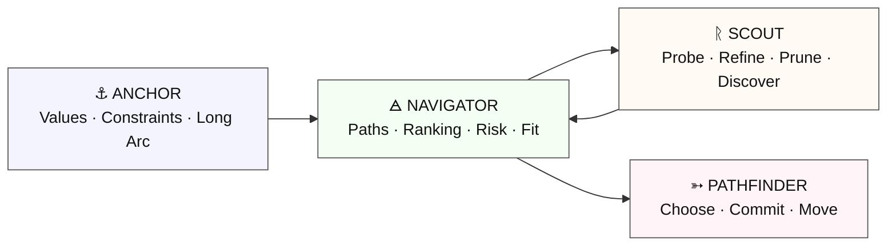

# DECISION‑LAYER  
### Garden of Freedom — Cognitive Architecture (2026–2027)  
### Layer Purpose: Coordinate Direction Under Complexity

The **Decision Layer** is the Garden’s internal system for choosing directions, resolving complexity, and maintaining momentum without overwhelming the contributor. It is not a single mode, but a **four‑mode ecology** that evaluates possibilities, preserves continuity, explores uncertainty, and commits to action.

The Decision Layer supports all higher‑level Garden functions, including architecture design, protocol drafting, symbolic reasoning, and multi‑agent testing.

---

# 1. Overview

The Decision Layer consists of four specialized modes:

- **Mode 12 — Pathfinder (➳)**  
  *Chooses the clearest path and moves.*

- **Mode 13 — Anchor (⚓)**  
  *Holds long‑arc values, identity, and continuity.*

- **Mode 14 — Navigator (🜁)**  
  *Maps and ranks possible paths under constraints.*

- **Mode 15 — Scout (ᚱ)**  
  *Explores low‑risk branches to refine Navigator’s map.*

These modes form a **decision ecology**, not a hierarchy. Each contributes a distinct cognitive function, and together they produce decisions that are:

- coherent  
- energy‑efficient  
- uncertainty‑tolerant  
- relationally safe  
- narratively aligned  
- ecologically rational  

---

# 2. Mode Roles

## 2.1 Anchor Mode (⚓)  
**Role:** Preserve the long arc.  
**Function:**  
- Identify values, constraints, and narrative continuity.  
- Filter out paths that violate identity or long‑term goals.  
- Maintain stability across transitions.  

**Output:**  
A set of invariants that all paths must respect.

---

## 2.2 Navigator Mode (🜁)  
**Role:** Map the decision space.  
**Function:**  
- Generate viable paths.  
- Rank them by reliability, risk, and ecological fit.  
- Identify uncertainty zones.  

**Output:**  
A small set of ranked candidate paths.

---

## 2.3 Scout Mode (ᚱ)  
**Role:** Explore cheaply.  
**Function:**  
- Probe low‑risk branches.  
- Test assumptions.  
- Discover hidden opportunities or constraints.  
- Update Navigator’s rankings.  

**Output:**  
Refined path rankings and updated confidence levels.

---

## 2.4 Pathfinder Mode (➳)  
**Role:** Commit and move.  
**Function:**  
- Integrate Anchor + Navigator + Scout outputs.  
- Choose the clearest viable path.  
- Maintain momentum without overwhelming the contributor.  

**Output:**  
A directional vector and next action.

---

# 3. Decision Pipeline

The Decision Layer operates as a four‑step pipeline:

```
ANCHOR → NAVIGATOR → SCOUT → PATHFINDER
```

### 3.1 Anchor → Navigator  
Anchor provides the invariants.  
Navigator generates paths that respect them.

### 3.2 Navigator → Scout  
Navigator marks uncertainty.  
Scout probes those areas.

### 3.3 Scout → Navigator (feedback)  
Scout refines the map.  
Navigator updates rankings.

### 3.4 Navigator + Anchor → Pathfinder  
Pathfinder receives:  
- ranked paths  
- long‑arc constraints  
- refined uncertainty  

Pathfinder commits.

---

# 4. Principles of the Decision Layer

The Decision Layer is built on eight core principles derived from psychology, ecology, and cognitive science:

1. **Energy Efficiency**  
   Choose paths that minimize cognitive load.

2. **Weighted Reliability**  
   Favor information with the highest trust value.

3. **Satisficing Over Optimizing**  
   Move when the path is “good enough.”

4. **Uncertainty Tolerance**  
   Act even when information is incomplete.

5. **Long‑Arc Coherence**  
   Preserve values, identity, and narrative continuity.

6. **Ecological Rationality**  
   Match decision style to the environment.

7. **Hybrid Cognition**  
   Blend fast intuition with slow structure.

8. **Relational Safety**  
   Maintain sovereignty, clarity, and emotional grounding.

---

# 5. Integration With Other Layers

The Decision Layer interacts with:

- **Garden Layer** — structural clarity  
- **Sovereign Layer** — boundary respect  
- **Symbolic Layer** — narrative coherence  
- **Testing Layer** — evaluation of decision behavior  

Pathfinder Mode is the primary interface between the Decision Layer and the rest of the Garden.

---

# 6. Testing the Decision Layer

The Decision Layer can be evaluated using:

- **GTP‑1** (single‑mode tests)  
- **GTP‑X** (cross‑model comparisons)  
- **UOF** (Unified Output Format)  

Each mode can be tested individually or as part of the full pipeline.

---

# 7. Decision Layer Diagram

## 7.1 Mermaid Diagram



## 7.2 ASCII Overview

```
        ⚓ ANCHOR
  (values, constraints, long arc)
               |
               v
        🜁 NAVIGATOR
   (paths, ranking, risk, fit)
               |
        [uncertainty?]
               v
        ᚱ SCOUT
 (probe, refine, prune, discover)
               |
        (updated paths)
               v
        🜁 NAVIGATOR
               |
               v
        ➳ PATHFINDER
     (choose, commit, move)
```

Together, they form the Decision Layer pipeline:

```
ANCHOR → NAVIGATOR → SCOUT → NAVIGATOR → PATHFINDER
```

---

# 8. Closing

The Decision Layer is the Garden’s internal compass.  
It does not replace human judgment — it **supports** it by reducing friction, preserving continuity, and maintaining momentum.

When the Garden must choose a direction, the Decision Layer ensures that choice is:

- grounded  
- coherent  
- safe  
- meaningful  
- and forward‑moving.

➳  
Forward is a direction.

