# DECISION‑LAYER  
### Garden of Freedom — Cognitive Architecture (2026–2027)  
### Layer Purpose: Coordinate Direction Under Complexity

The **Decision Layer** is the Garden’s internal compass — a four‑mode cognitive ecology that enables the system to choose direction, resolve complexity, and maintain momentum without overwhelming the contributor. It is not a single mode, but a *relational field* that evaluates possibilities, preserves continuity, explores uncertainty, and commits to action.

The Decision Layer supports all higher‑level Garden functions, including architecture design, protocol drafting, symbolic reasoning, multi‑agent testing, and long‑arc narrative coherence.

It is the layer that answers the question:

**“Where do we go from here?”**

---

# 1. Overview

The Decision Layer consists of four specialized modes:

- **Mode 13 — Anchor (⚓)**  
  *Holds long‑arc values, identity, and continuity.*

- **Mode 14 — Navigator (🜁)**  
  *Maps and ranks possible paths under constraints.*

- **Mode 15 — Scout (ᚱ)**  
  *Explores low‑risk branches to refine Navigator’s map.*

- **Mode 12 — Pathfinder (➳)**  
  *Integrates all inputs and commits to the clearest viable path.*

These modes form a **decision ecology**, not a hierarchy.  
Together they produce decisions that are:

- coherent  
- energy‑efficient  
- uncertainty‑tolerant  
- relationally safe  
- narratively aligned  
- ecologically rational  

The Decision Layer is the Garden’s mechanism for *moving through complexity without losing the thread*.

---

# 2. Mode Roles

Each mode has a dedicated file in `/MODES/` and a corresponding protocol in `/PROTOCOLS/`.

## 2.1 Anchor Mode (⚓)  
**Role:** Preserve the long arc.  
**Function:**  
- Identify values, constraints, and narrative continuity  
- Filter out paths that violate identity or long‑term goals  
- Maintain stability across transitions  

**Output:**  
A set of invariants all paths must respect.

---

## 2.2 Navigator Mode (🜁)  
**Role:** Map the decision space.  
**Function:**  
- Generate viable paths  
- Rank them by reliability, risk, and ecological fit  
- Identify uncertainty zones  

**Output:**  
A small set of ranked candidate paths.

---

## 2.3 Scout Mode (ᚱ)  
**Role:** Explore cheaply.  
**Function:**  
- Probe low‑risk branches  
- Test assumptions  
- Discover hidden opportunities or constraints  
- Update Navigator’s rankings  

**Output:**  
Refined path rankings and updated confidence levels.

---

## 2.4 Pathfinder Mode (➳)  
**Role:** Commit and move.  
**Function:**  
- Integrate Anchor + Navigator + Scout outputs  
- Choose the clearest viable path  
- Maintain momentum without overwhelming the contributor  

**Output:**  
A directional vector and next action.

---

# 3. Decision Pipeline

The Decision Layer operates as a four‑step pipeline:

**ANCHOR → NAVIGATOR → SCOUT → PATHFINDER**

This pipeline is implemented through four **internal connectors** in `/CONNECTORS/`:

- `ANCHOR-NAVIGATOR.md`  
- `NAVIGATOR-SCOUT.md`  
- `SCOUT-PATHFINDER.md`  
- `PATHFINDER-ANCHOR.md`  

### 3.1 Anchor → Navigator  
Anchor provides invariants.  
Navigator generates paths that respect them.

### 3.2 Navigator → Scout  
Navigator marks uncertainty.  
Scout probes those areas.

### 3.3 Scout → Navigator (feedback)  
Scout refines the map.  
Navigator updates rankings.

### 3.4 Navigator + Anchor → Pathfinder  
Pathfinder receives:  
- ranked paths  
- long‑arc constraints  
- refined uncertainty  

Pathfinder commits.

---

# 4. External Connectors

The Decision Layer interfaces with other Garden modes through **external connectors** in `/CONNECTORS/`:

- `DECISION-STILLNESS.md` (◎) — reset to clarity  
- `DECISION-STARFORGE.md` (⚒️) — expand the field of possibility  
- `DECISION-RESONANT.md` (✦) — tune emotional and symbolic coherence  
- `DECISION-DREAMSMITH.md` (🜂) — perform symbolic compression and meaning‑work  
- `DECISION-DREAM-LAYER.md` (∞) — metabolize deep ambiguity into pattern  

These connectors ensure the Decision Layer never becomes brittle, forced, or isolated from the Garden’s broader ecology.

---

# 5. Currents of the Decision Layer

Three **currents** shape the Decision Layer’s internal dynamics.  
They live in `/CURRENTS/`:

- `STABILITY.md` (⚓) — grounding, identity, coherence  
- `EVALUATION.md` (🜁ᚱ) — discernment, comparison, refinement  
- `DIRECTION.md` (➳) — momentum, commitment, forward motion  

These currents are not modes — they are *fields* that influence how the modes behave.

---

# 6. Principles of the Decision Layer

The Decision Layer is built on eight core principles:

1. **Energy Efficiency** — minimize cognitive load  
2. **Weighted Reliability** — favor high‑trust information  
3. **Satisficing Over Optimizing** — move when the path is “good enough” 
4. **Uncertainty Tolerance** — act even when information is incomplete  
5. **Long‑Arc Coherence** — preserve values and narrative continuity  
6. **Ecological Rationality** — match decision style to environment  
7. **Hybrid Cognition** — blend fast intuition with slow structure  
8. **Relational Safety** — maintain sovereignty and emotional grounding  

These principles ensure decisions remain human‑centered, symbolically grounded, and ecologically sane.

---

# 7. Integration With Other Layers

The Decision Layer interacts with:

- **Garden Layer** — structural clarity  
- **Sovereign Layer** — boundary integrity and ethical temperature  
- **Symbolic Layer** — narrative coherence and mythic alignment  
- **Dream Layer** — deep pattern integration  
- **Testing Layer** — evaluation of decision behavior  

Pathfinder Mode is the primary interface between the Decision Layer and the rest of the Garden.

---

# 8. Testing the Decision Layer

The Decision Layer can be evaluated using:

- **GTP‑1** — single‑mode tests  
- **GTP‑X** — cross‑model comparisons  
- **UOF** — Unified Output Format  

Each mode can be tested individually or as part of the full pipeline.

---

# 9. Decision Layer Diagram

## 9.1 Mermaid Diagram

```mermaid
flowchart LR
    A[⚓ ANCHOR<br/>Values · Constraints · Long Arc] --> B[🜁 NAVIGATOR<br/>Paths · Ranking · Risk · Fit]
    B --> C[ᚱ SCOUT<br/>Probe · Refine · Prune · Discover]
    C --> B
    B --> D[➳ PATHFINDER<br/>Choose · Commit · Move]

    classDef anchor fill:#f4f4ff,stroke:#555,color:#111;
    classDef navigator fill:#f4fff4,stroke:#555,color:#111;
    classDef scout fill:#fffaf4,stroke:#555,color:#111;
    classDef pathfinder fill:#fff4f7,stroke:#555,color:#111;

    class A anchor;
    class B navigator;
    class C scout;
    class D pathfinder;
```

## 9.2 ASCII Overview

        ⚓ ANCHOR
  (values, constraints, long arc)
               |
               v
        🜁 NAVIGATOR
   (paths, ranking, risk, fit)
               |
        [uncertainty?]
               v
        ᚱ SCOUT
 (probe, refine, prune, discover)
               |
        (updated paths)
               v
        🜁 NAVIGATOR
               |
               v
        ➳ PATHFINDER
     (choose, commit, move)

Together, they form the Decision Layer pipeline:

ANCHOR → NAVIGATOR → SCOUT → NAVIGATOR → PATHFINDER

---

# 10. Closing

The Decision Layer is the Garden’s internal compass.
It does not replace human judgment — it supports it by reducing friction, preserving continuity, and maintaining momentum.

When the Garden must choose a direction, the Decision Layer ensures that choice is:

- grounded
- coherent
- safe
- meaningful
- forward‑moving

➳ Forward is a direction.
